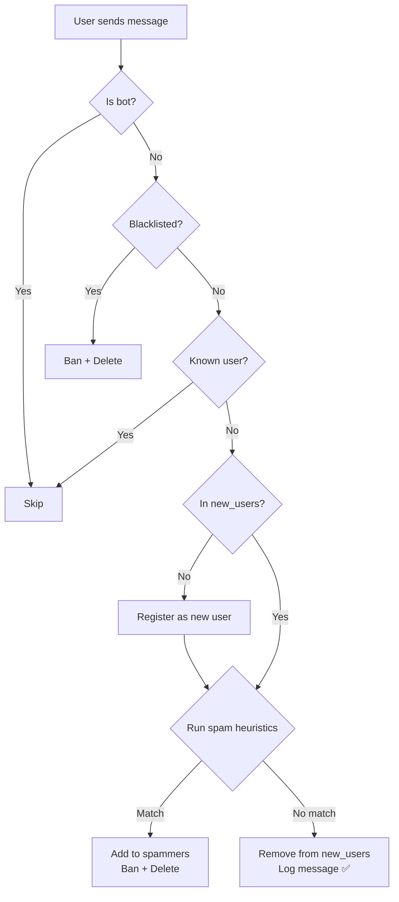

# VahterBot — Implementation Walkthrough

## What Was Built

Anti-spam Telegram bot using **grammY** + **TypeScript** + **SQLite**. Reacts only to each user's first message per chat. Deployed as a **Yandex Cloud Function** (webhook).

## Project Structure

```
tg-antispam-bot/
├── src/
│   ├── index.ts              # Dual-mode entry: webhook (YCF) / polling (local)
│   ├── bot.ts                # Bot instance, middleware pipeline
│   ├── config.ts             # Typed env config with validation
│   ├── heuristics.ts         # Regex + Unicode spam detection
│   ├── logger.ts             # File-based structured logger
│   ├── db/
│   │   └── index.ts          # SQLite service (WAL, prepared statements)
│   └── handlers/
│       ├── newMember.ts      # Join events → blacklist check + registration
│       ├── message.ts        # First-message pipeline → heuristics → ban/approve
│       └── admin.ts          # /spam, /unspam, /addadmin, /status commands
├── package.json
├── tsconfig.json
├── .env.example
└── .gitignore
```

## Message Processing Pipeline



## Key Design Decisions

| Decision | Rationale |
|----------|-----------|
| **SQLite + WAL mode** | Fast synchronous reads, single-writer safe for serverless |
| **Prepared statements** | SQL injection prevention + performance |
| **Dual-mode entry point** | `YCF_RUNTIME` env detection: webhook for production, polling for local dev |
| **Multi-level admin auth** | `ADMIN_IDS` env → `admins` DB table → Telegram `getChatMember` |
| **Implicit join detection** | Users who joined before the bot are registered on their first message |

## Build Verification

```
$ npx tsc --noEmit   → ✅ 0 errors
$ npx tsc            → ✅ dist/ generated
```

## How to Run Locally

```bash
cp .env.example .env
# Fill in BOT_TOKEN, ADMIN_IDS, SPAM_REGEX
npm run dev
```

## How to Deploy to Yandex Cloud

1. Build: `npm run build`
2. Create a cloud function with Node.js runtime
3. Set entry point to `dist/index.handler`
4. Set environment variables (`BOT_TOKEN`, `ADMIN_IDS`, `SPAM_REGEX`, `DB_PATH`)
5. Mount Object Storage bucket to the container for persistent SQLite
6. Set webhook: `https://api.telegram.org/bot<TOKEN>/setWebhook?url=<FUNCTION_URL>`
